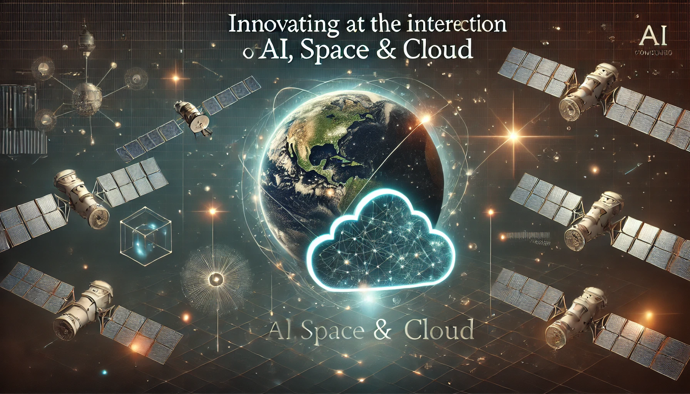

# El Yakub - GitHub Profile

## 🌍 About Me

I am an experienced software developer with a strong passion for technology and a long-term commitment to GitHub. With over 10 years of activity on the platform, I have constantly showcased my skills and interests through various projects. My background in Telecommunication and Wireless Technologies has equipped me with a versatile skill set, allowing me to proficiently work with different programming languages and contribute to diverse projects.

My work focuses on web development, and I am well-versed in languages such as TypeScript, JavaScript, HTML, CSS, and Python. This expertise enables me to develop visually compelling and dynamic applications. Additionally, I have a keen interest in cloud computing, AI, and geospatial intelligence, which drives me to explore and innovate in these fields.

Currently, my main areas of focus are centered around building impactful and innovative solutions. I am developing a SaaS platform for small satellite operators, where I leverage cloud computing and AI to provide efficient mission planning software. The goal is to serve emerging markets, particularly in Nigeria and Africa, where space applications are gaining traction. Additionally, I am working on an AI-driven geospatial data interface that allows users to interact with satellite and geospatial data using natural language and voice queries.

## 💻 Tech Stack & Skills

- **Languages:** TypeScript, JavaScript, HTML, CSS, Python
- **Web Development:** React, Node.js
- **Cloud & DevOps:** AWS, Docker
- **Databases:** PostgreSQL, MongoDB
- **Artificial Intelligence:** NLP, Machine Learning, Deep Learning
- **Geospatial Technologies:** GIS, Remote Sensing, Google Earth Engine

## 📊 GitHub Stats

## 🔥 Featured Projects

Here are some of my notable projects:

### [Project 1: ngdi-v1](https://github.com/Some19ice/ngdi-v1)

Description: A dynamic web application built using Nextjs for managing and displaying geospatial data.

### [Project 2: ngdi-metadata-tool-v1](https://github.com/Some19ice/ngdi-metadata-tool-v1)

Description: A REST API built with Django REST Framework for managing and editing metadata of geospatial datasets.

### [Project 3: Modern Portfolio](https://some19ice.github.io/modern_portfolio/)

Description: A responsive portfolio website showcasing my work as a Web Developer, Programmer, Designer & Entrepreneur.

## 📬 Contact Me

Feel free to reach out to me on the following platforms:

- **Email:** [some1me247@gmail.com](mailto:some1me247@gmail.com)
- **Twitter:** [@some19ice](https://twitter.com/some19ice)

Let's connect and collaborate!

---

Keep exploring, learning, and building solutions that matter. Together, we can make a real impact in the world of technology!

